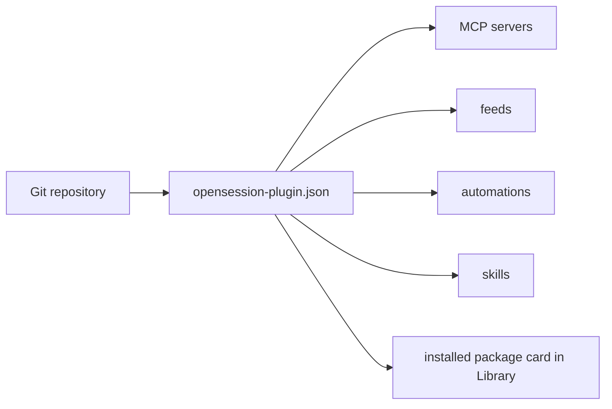

# Plugins — design proposal

**Update (2026-08-16): the data-only half shipped.** A package is a git
repository with a manifest bundling feeds, automation recipes, skills and MCP
server entries, installed with `opensession plugins add <owner/repo>` and
listed in the Library. Runtime-loaded code is explicitly deferred, with
reasons. See [packages.md](packages.md) and
[adrs/publishable-packages.md](../adrs/publishable-packages.md); the plugin
runtime described below is still a proposal.

**Update (2026-08-13): Notes was removed from core** — the collaborative-notes
store, its routes, WebSocket relay, MCP server and UI are gone, and so is its
library card. The stored documents under `~/.opensession-notes/` were left
untouched. Notes is the intended first real plugin, so the passages below that
use it as the worked example describe a feature that no longer ships; read them
as a design for what a plugin has to be able to do, not as a description of
current behavior.

**Status: the first slice of the library is built; the plugin runtime is a
proposal.** Settings → Library (`packages/core/opensession-server/src/server/library.ts`, `LibraryPanel.tsx`)
currently browses 29 shipped entries: five manually maintained core tools,
seventeen automations from seven recipes and ten templates, and seven
integrations. It also adds one card per installed package. Everything about the
runtime, and the server-side feature gate that would make a tool switch real,
is still design. This is the plan for turning Open Session's extension points
into a plugin library, and for letting people who fork this repository add
their own tools — with their own UI — that work with their sessions.

Read [extending.md](extending.md) first. That document describes what exists;
this one describes where it is going and, more usefully, which of the obvious
designs are wrong and why.

## The ask, and the two products hiding in it

The starting brief was: _some features (tasks, notes) are not useful for
everyone, so make them plugins and give us a library to browse — like Obsidian.
Eventually, people should be able to build their own tools on top of Open
Session, alter the UI, and have those tools work directly with their sessions._

That is two products, and they have almost nothing to do with each other:

1. **A library.** Browse and install things that are _already data_ in this
   codebase — MCP servers, automations, skills, feed projects — plus first-party
   features behind a real switch. Buildable now, no new architecture.
2. **A plugin runtime.** Third-party code contributing UI surfaces. This is the
   hard one, and it is where every serious decision below lives.

Doing (1) first is not avoidance. Obsidian's "core plugins" — daily notes,
canvas, templates — were never extracted into plugins architecturally. They are
built-in features with a toggle, listed in the same browse UI as community
plugins. That is the right precedent for Notes and Tasks: give them a card and a
switch, and leave physical extraction as an optional, invisible cleanup.

## What already works, and the one thing that does not

The feeds system calls itself "Open Session's plugin seam" in its own module doc
(`packages/core/opensession-server/src/agents/types.ts`), and it is closer to delivering the brief than it looks.
A tool defined as a **connected MCP server plus a feed descriptor**
(`~/.opensession/feeds.json`) already gets, with zero code:

- a sidebar band listing its items
- each item resolving to a **workspace** with sessions attached, keyed
  `<refKind>-<id>` so the same item reopens the same workspace forever
  (`resolveExternalWorkspace`)
- agents reading and writing that data through the MCP server, scoped by the
  descriptor's `mcpServers` allowlist
- the item's content injected into a session's opening prompt (the `context`
  spec in `feeds-config.ts`)

Those last three bullets _are_ "it works directly with all their chats." That
part is done.

The gap is narrow and precise: **a feed can display items, but nothing can create
or edit one.** There is no write path from the UI, and no panel beyond an iframe
of somebody else's web page.

### The worked example

Take the backlog tool — a list of feature requests you can add to, that agents
can read and file into. Today: the band, the workspaces, the agent tools and the
context injection all come free; only the add/edit UI is missing.

Close that with a **panel derived from the MCP tool's JSON Schema** — tools
already carry one — submitting through an authenticated proxy route, and the
backlog is essentially done with no plugin system at all. It will look like an
admin panel rather than a product. That is the correct default: "replace the
generated panel with my own component" is exactly what the plugin runtime is
for, and having a working generic panel means the runtime is an upgrade rather
than a prerequisite.

## Decisions

### Storage: there is no plugin data store

The tempting design is a namespaced key-value or document API per plugin. It is
a trap twice over: it is a junk drawer that immediately inherits the multi-user
permission model, and — fatally — it creates a second data plane that **agents
cannot reach**.

Since an agent has to read and write the plugin's data anyway, the MCP server
has to exist anyway. So the plugin's data API _is_ its MCP server, reached from
the UI through one authenticated `POST /api/mcp/:server/:tool` proxy, scoped by
the same allowlist and identity machinery sessions already use
(`filterMcpServers`). One storage story, one permission story, and _anything the
UI can do, a chat can do by construction_ — the brief's headline requirement
falls out of the architecture instead of being built twice.

The Obsidian-vault equivalent here is not an API at all: it is a directory per
tool under the state dir plus the MCP contract. That is already the house
pattern — notes, assets and feeds are each "an MCP surface with its own files."

### UI: runtime-loaded ESM sharing the host's React

Three mechanisms were considered for third-party UI:

|                                                            | Verdict                                                                                                                                                                                                    |
| ---------------------------------------------------------- | ---------------------------------------------------------------------------------------------------------------------------------------------------------------------------------------------------------- |
| **iframe + postMessage host API**                          | No. Expensive to build, weakest expressiveness, and the hardest tier to secure. Keep iframes as what they are today — an escape hatch for embedding _external products_ — and do not grow them a host API. |
| **Build-time only** (npm dep + one registry line, rebuild) | Viable, and this is Backstage's model. But see below.                                                                                                                                                      |
| **Runtime-loaded ESM bundle sharing one React instance**   | Yes.                                                                                                                                                                                                       |

The third is what [bb](https://github.com/get-bb/bb) does, and it is strictly
better than the other two: the plugin's own React is compiled to a separate ESM
file, with the shared modules (react, the SDK, portalling component families)
swapped by a build-time shim for references to a global runtime object the host
provides. One React instance, so no "Invalid hook call"; no host rebuild, so
reload is per-plugin; full UI power.

Note what this costs and what it does not. It does **not** avoid a trust
decision — see the security section. It does avoid the rebuild, which matters
less here than anywhere else, because in this product _the agent is the
installer_: the server rebuilds its own frontend in-process and runs code
sessions against its own checkout. "Install a plugin" can legitimately be "ask a
session to add the dep and rebuild." That is why the build-time tier is not
obviously worse, and why the runtime tier should be judged on ergonomics rather
than on necessity.

### No component library

Ship a handful of primitives at most, and have plugins vendor component source
(the shadcn model) rather than importing ours. bb learned this the expensive
way: publishing dozens of component prop types makes _every_ host component
change a plugin-breaking change.

The corollary for everything else in the contract: **one blessed import
module.** Everything a plugin may use is re-exported from a single entry point;
deep imports are unsupported and lint-banned. Backstage's plugin pain came
almost entirely from plugins importing whatever they could reach while core
churned underneath.

### Host semantics arrive precomputed

When a plugin draws something the host also draws — a status indicator, an
unread state, a sort order — hand it the _already-resolved_ answer, not the
inputs. The plugin draws the glyph; it never re-implements the precedence rules.
It then gets correct behaviour for free and cannot drift.

Likewise, plugin surfaces should read the host's existing query cache rather
than fetching their own copy: a plugin-contributed session list that adds no
request is a much better citizen than one that duplicates the fetch.

### Per-plugin scoped CSS

Compile each plugin's Tailwind pass inside `@scope ([data-plugin="<id>"])`.
Without it, a plugin's plain `.flex-col` beats the host's `sm:flex-row`, because
a media query adds no specificity. This is not hypothetical; it is the first bug
a plugin ships.

### Distribution: git packages now, code tier later

The shipped data-only tier is not curated in-repo. Packages are git
repositories discovered through the uncurated `opensession-plugin` GitHub topic
and installed from an `owner/repo`, git URL or local path. There is no hosted
registry. `opensession-plugin.json` is the composite envelope for MCP servers,
feeds, automations and skills. `~/.opensession/plugins.json` records each
package's source, commit, checkout directory and installed artifacts, including
each skill's `SKILL.md` hash. `skills-lock.json` remains unused.

Distribution and consent for a future runtime-code tier remain a separate
proposal.

### Install scope

Installation is per-instance; _enablement_ is per-project. Per-project
installation would fragment the trust decision — vetting the same MCP server
once per project — while scoping at point of use is already the pattern three
times over (feeds scope `mcpServers`, automations carry allowlists, servers
carry `allowedUsers`). That satisfies "add tools to your project" without
splitting the trust model.

## The catalog envelope

The shipped `PackageManifest` in
`packages/core/opensession-server/src/server/plugins.ts` is the data-package
envelope. `opensession-plugin.json` carries shared package metadata and can
bundle several MCP servers, feeds, automations and skills in one reviewed
install. Each artifact keeps its existing type-specific schema and store;
`Recipe` remains automation-specific. The Library separately normalizes these
packages and built-in sources into card-shaped `LibraryEntry` values.

A future runtime-code contribution should be a separately gated manifest field,
not behaviour added to the existing artifact schemas.

## The Tasks switch is still cosmetic

Sidebar visibility keeps a synchronous per-user local cache and syncs
`sidebar-hidden-tools` through `/api/ui-prefs`. The native app reads the same
account preference, so visibility follows the user across web and iOS. It is
still only a visibility preference: hiding Tasks does not disable its routes,
agent tools, Desk todos, Web Push or Slack reminders.

So the real deliverable behind "make tasks a plugin" is a **server-side feature
gate** covering the routes, the WebSocket handlers and — the part that makes it
real rather than cosmetic — the side effects. Roughly a day per feature, versus
weeks for a physical extraction no user can perceive. Tasks, with its Slack,
push and Desk reach, is the acceptance test for whether the gate is genuine.

## Security

Two rules that go beyond what comparable products enforce, because the blast
radius here is bigger: an Open Session instance holds Slack, GitHub and Stripe
credentials _and_ runs autonomous agents over untrusted ticket text.

- **A plugin-originated session must be least-privilege.** Interactive runs
  currently receive `opensession-admin` and `opensession-sessions`. If a plugin
  surface can create a session, a malicious plugin escalates to reconfiguring
  the instance and steering other people's sessions. That session kind needs
  those servers stripped — the same fail-closed treatment automations get.
- **Code plugins never install one-click from the catalog.** With web auth
  enabled, same-origin JavaScript cannot read the HttpOnly session token, but
  its API and WebSocket requests carry the browser's credentials and can act as
  the signed-in user. With web auth disabled there is no session token, and the
  same-origin APIs remain reachable. The library may one-click _declarative_
  entries only; code plugins go through an explicit trust prompt that a
  non-interactive caller cannot skip.

Related, and worth fixing before any plugin asset is ever served same-origin:
`FeedWebPane`'s iframe has no `sandbox` attribute and grants `clipboard-write`.
That is defensible today, when every embed is a foreign origin. It is a landmine
the moment it is not.

## Contract discipline

Prefix every unstable member `experimental_`, keep a written audit list of what
must be checked before each one stabilises, and treat dropping the prefix as a
deliberate act. Most importantly: **do not publish the contract until it has
survived two breaking revisions against our own consumers.** The first external
plugin freezes whatever interfaces exist that day, including the bad ones.

The current "panel registry" is two hardcoded ternaries (`SessionViewer.tsx`,
`WorkspacePane.tsx`) checking for `component === "slack-channel"`. That is
nowhere near worth freezing.

## Plan

The Library and data-package parts of phase 2 have shipped. The runtime and
server-side feature gates remain proposed.

| Phase | What                                                                                                                                     | Why here                                                                                                 |
| ----- | ---------------------------------------------------------------------------------------------------------------------------------------- | -------------------------------------------------------------------------------------------------------- |
| 1     | MCP proxy route + schema-derived CRUD panel                                                                                              | Makes the backlog example real with no platform work, and gives every future plugin a working default UI |
| 2     | Library browse UI + git-distributed data-package envelope; server-side feature gates for Tasks and any future Notes plugin               | The installables already exist; this is the whole library value at near-zero architectural risk          |
| 3     | Surface registry: flat `PLUGINS: PluginDef[]` in one file, generic lookups replacing the hardcoded sites                                 | Dogfood on Notes, Tasks and `slack-channel` — deleting those two ternaries is the proof the seam is real |
| 4     | Plugin runtime: manifest block, server + app entry points, shared-runtime shim, scoped CSS, per-slot error boundaries, per-plugin reload | Only worth building once three first-party consumers have shaped the slots                               |
| 5     | Scaffold (`bun create`), optimised for an _agent_ to run — that is who will write most of these                                          |                                                                                                          |

Phase 3 is worth a note. It looks like a refactor and gets deprioritised for
that reason, but it is the only phase the brief's UI requirement strictly needs,
and it _reduces_ collision pressure in the shared checkout rather than adding
it: today a new tool edits `App.tsx` and `Sidebar.tsx` in around eleven places;
afterwards a fork touches one line in one small file plus its own directory. Do
it as four small mechanical commits — generic `activeTool`/`onOpenTool` props,
then a `TOOL_META` record, then one `{view: "tool"}` route variant, then a
component map — each landable in a single session.

## Traps

- **Install state must be server-side.** localStorage means installed-in-Chrome,
  absent-on-iOS.
- **Seed resurrection.** `ensureConfiguredAutomations` is create-if-absent, so
  uninstalling an automation must reverse the config seed, not just delete the
  store row, or it returns on the next boot.
- **Disable is not uninstall.** Disabling Notes must not touch the Yjs
  documents.
- **Installed skill location.** Package skills are copied into
  `SHIPPED_SKILLS_DIR` (`OPENSESSION_SKILLS_DIR` or this installation's
  `.agents/skills`). `skillSearchPaths()` includes that directory for every run,
  so fresh worktrees need no materialization. A standalone browsable skill
  catalog remains unimplemented.
- **Do not build a fourth CRUD surface.** The catalog is a front door: browse,
  install, then deep-link into the existing Connections and Automations UIs. It
  is not a parallel editor.
- **Cross-client.** A plugin contributing a web surface contributes nothing to
  the native app, the TUI or the extension. Decide per surface whether that is
  acceptable and say so, rather than discovering it in a bug report.

## Prior art

- **[bb](https://github.com/get-bb/bb)** — the closest analogue, and worth
  reading before building any of phase 4. Manifest is a `bb` block in
  `package.json`; `server` and `app` entry points; runtime-loaded, full-trust,
  in-process; install from path, npm, git or the bundled copy; no remote
  registry. Its four official plugins are GitHub, Docs, Memory and **Tasks** —
  independent confirmation that notes and tasks are the right first candidates.
  Read `packages/plugin-sdk/src/app-contract.ts` as the truth and the docs as
  design intent; they have drifted.
- **Obsidian** — the library UX, the core-plugins-are-toggles precedent, and the
  cautionary half: it ships compromised community plugins regularly, and it is a
  notes app rather than a credential concentrator.
- **Backstage** — the "good boilerplate, build your own tools on our core"
  model, plugins as npm packages compiled into your app. Its lesson is that the
  difference between a plugin and a patch is _rebaseability_, not runtime
  loading.
