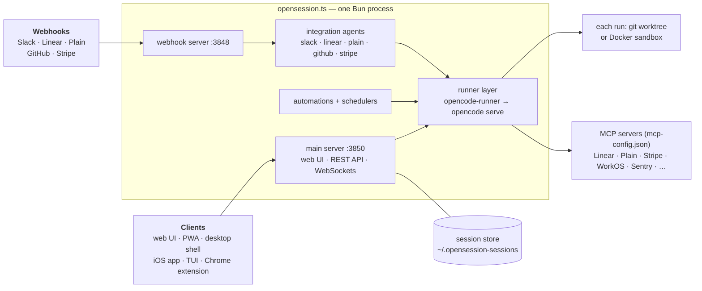

# Open Session setup

Operator documentation for self-hosting Open Session. Start at
[install.md](install.md); the other pages are per-integration and optional.

## What it is

Open Session is a self-hosted agent-infrastructure server. One Bun process serves:

- **A web UI** for creating and steering coding sessions that run
  against registered git repos, in isolated worktrees or Docker sandboxes.
- **Agents** that turn external events into sessions: Slack messages, Linear
  issues, Plain support tickets, GitHub PR review comments.
- **One engine** that actually runs the agent turns: OpenCode, with Claude
  subscription capacity via the bundled Meridian bridge and ChatGPT-OAuth
  OpenAI capacity ([engines.md](engines.md)).
- **Automations**: stored prompts triggered by events or cron, run with
  least-privilege tool scoping ([plain.md](plain.md) documents the flagship
  triage automation).

## Architecture sketch

A second small HTTP server (the webhook server, default port 3848) receives
GitHub/Linear/Plain/Stripe webhooks; the main server (default 3850) serves the
UI and API at the root of your instance URL.

## Minimum requirements

- A supported server environment: Linux, macOS, or Ubuntu under WSL2 on
  Windows. The server does not run directly from PowerShell. See the
  [WSL2 install path](install.md#windows-run-the-server-in-wsl2). Tella runs
  Ubuntu on EC2; nothing requires AWS. The AWS-specific deploy pipeline in
  [github.md](github.md) is replaceable.
- [Bun](https://bun.sh) — runtime, package manager, and bundler. No Node/Vite.
  The installer brings its own; you only need it up front for a manual install.
- `git`, and the [`gh` CLI](https://cli.github.com) for PR operations.
- The `opencode` binary — the engine that runs every agent turn. The installer
  installs it by default (`--no-engine` opts out).
- The `claude` CLI (Claude Code) — the bundled Meridian bridge shells out to
  it for Anthropic models (`OPENSESSION_CLAUDE_BIN`, default: `claude` found
  on `PATH`).
- **Tailscale** — the recommended way to expose the UI at all. The installer
  installs it with `--tailscale` (the default install binds loopback only);
  joining a network is a separate step that needs your account.
- Optional: **Docker** (sandboxed sessions —
  [self-hosting-sandboxes](../self-hosting-sandboxes.md)), **Caddy** (TLS for
  live previews), `whisper.cpp`/Groq/OpenAI key (voice dictation).

## Trust model (read this)

**By default there is no authentication.** Open Session binds to `HOST` (default
`127.0.0.1`) and trusts everyone who can reach that address. The UI "user" is a
self-selected display name in localStorage — it drives attribution and per-user
tool gating, not access control. On a default install, **the bind address is the
security boundary**: put it behind Tailscale or an equivalent private network and
never expose it publicly. [networking.md](networking.md) covers how.

**Authentication is available, and it is opt-in.** Setting
`integrations.github` with `userPrAuth` and an OAuth client id activates GitHub
sign-in: every `/api/*` request and the UI WebSocket require a session cookie,
only logins listed in `identity.team` may sign in, and the verified identity
overrides any client-claimed user. Tella's own deployment runs with this on. See
[github.md](github.md#per-user-github-auth-prs-as-the-session-owner).

Turning it on does **not** make the server safe to expose publicly. It protects
the UI and API; it does not change the fact that a session executes arbitrary
code on your machine. Keep the network boundary and treat sign-in as defence in
depth.

Inside that boundary, safety comes from least-privilege scoping of what *runs*
can do, enforced at the tool and environment layer rather than in prompts:

- automation runs — the ones processing untrusted text like customer tickets —
  get a minimal environment with none of your API tokens
- each automation carries an MCP-server allowlist, so a run only sees the tools
  it was granted
- customer-facing and identity-mutating tools are hard-denied for unattended runs
- money-moving tools are stripped from the model's tool list entirely
- the systemd unit and the sandbox host setup both block the cloud metadata
  endpoint, so agent code cannot mint cloud credentials

[extending.md](../extending.md#security-when-you-extend) has the rules to follow
when adding anything that touches this.

## Pages

| Page | Covers |
| --- | --- |
| [install.md](install.md) | installer → onboarding → env vars → config.json → accounts → systemd → health |
| [../instance-configuration.md](../instance-configuration.md) | everything instance-specific in `~/.opensession/config.json` — repos, identity, branding, policy, seeds |
| [networking.md](networking.md) | **keeping it private** — Tailscale, SSH tunnels, verifying exposure |
| [ec2.md](ec2.md) | provisioning a clean EC2 box, networking, SSH debugging |
| [../../recipes/README.md](../../recipes/README.md) | bundled automation recipes, and what belongs in the repo |
| [slack.md](slack.md) | Slack app, token, scopes, event intake, admin gating |
| [github.md](github.md) | GitHub token, webhook server, PR agent, deploy pipeline |
| [codestorage.md](codestorage.md) | code.storage as an alternative git host — signing key, repos, branch reviews |
| [linear.md](linear.md) | Linear OAuth app, webhooks, the Linear agent |
| [plain.md](plain.md) | Plain support tickets, the triage automation |
| [integrations-misc.md](integrations-misc.md) | Stripe, WorkOS, Grafana/Sentry/Tinybird, web push, voice |
| [engines.md](engines.md) | the OpenCode engine, account pools, usage & fallbacks, model routing |
| [../self-hosting-sandboxes.md](../self-hosting-sandboxes.md) | Docker/Daytona/E2B/Box/Modal/AWS Lambda MicroVM sandboxes |
| [../runners.md](../runners.md) | attaching a Mac/Linux/Windows box as a Runner |
| [../worktrees.md](../worktrees.md) | how sessions map to git worktrees, and where the disk goes |
| [../../CLIENTS.md](../../CLIENTS.md) | web UI, PWA, Electron shell, Swift app, Chrome extension |
| [../extending.md](../extending.md) | MCP servers, recipes, integrations, providers, skills |

The remaining files in `docs/` are contributor docs, not setup guides:
[transcripts.md](../transcripts.md) covers the transcript store and serve
protocol; [session-performance.md](../session-performance.md) is the frontend
session-render performance contract.
