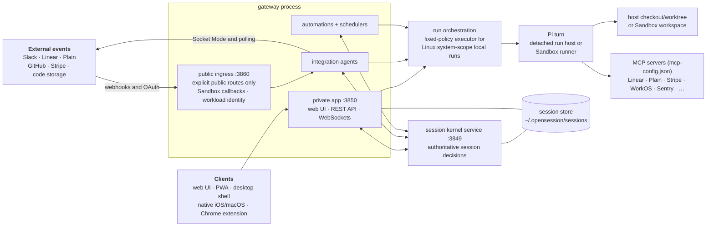

# Open Session setup

Operator documentation for self-hosting Open Session. Start at
[install.md](install.md); the other pages cover networking, instance
configuration, clients, execution backends, and optional integrations.

## What it is

Open Session is a self-hosted agent-infrastructure server. Its gateway,
supervised session kernel, and run processes provide:

- **A web UI** for creating and steering coding sessions against registered git
  repos. Sessions use host checkouts or worktrees, or a selected Sandbox.
- **Agents** that turn external events into sessions or automations: Slack
  messages, Linear issues, Plain support tickets, GitHub activity, and Stripe
  disputes.
- **One production engine**, Pi. Anthropic models use Claude subscription
  accounts through the Claude Agent SDK and installed `claude` CLI; OpenAI
  models use ChatGPT subscription accounts. Configured API-key providers also
  run through Pi ([engines.md](engines.md)).
- **Automations**: stored prompts triggered by events or cron, with runner-level
  environment, tool, and credential controls ([plain.md](plain.md) documents a
  support-triage example).

## Architecture sketch

The gateway owns both network listeners. The session kernel is a separate,
loopback-only supervised service. Linux system-scope installs also use the
fixed-policy executor to launch detached local run hosts; local turns use the
in-process path where detached execution is unavailable. See
[executor architecture](../executor-architecture.md).

The fail-closed public listener on 3860 receives only explicitly registered
public routes, including webhooks, OAuth callbacks, health checks, and asset
routes, plus remote Sandbox callbacks and workload-identity requests. The
separate app listener on 3850 serves the private UI and API.

## Minimum requirements

- A supported server environment: Linux, macOS, or Ubuntu under WSL2 on
  Windows. The server does not run directly from PowerShell. See the
  [WSL2 install path](install.md#windows-run-the-server-in-wsl2). Tella runs
  Ubuntu on EC2, but nothing requires AWS: `deploy/deploy.sh` is generic, and
  Tella's AWS SSM invocation is only one way to run it
  ([github.md](github.md#deploy-script)).
- `curl` and `git`. The installer requires both. The
  [`gh` CLI](https://cli.github.com) is needed for pull-request operations and
  is installed best-effort where the host package manager permits it.
- [Bun](https://bun.sh) for a manual source install. `install.sh` adds it when
  needed; the default compiled release embeds the runtime, Pi, and frontend, so
  it does not require Bun on `PATH`.
- The Pi engine runs every agent turn. It is compiled into the release binary
  and runs inside the turn process; a source install gets it through
  `bun install`. Nothing installs a separate `pi` binary on the box.
- The `claude` CLI (Claude Code) is required for Anthropic models
  (`OPENSESSION_CLAUDE_BIN`, default: `claude` found on `PATH`). The installer
  adds it by default.
- The `codex` CLI is required to add a ChatGPT subscription account through the
  in-app device flow. The installer adds it by default.
- `--no-engine` skips both model CLIs; `--no-codex` skips only Codex.
- **Tailscale** is the recommended way to share the private UI. On Linux the
  installer can add it with `--tailscale`; on macOS install the Tailscale app.
  The default install binds loopback, and joining a tailnet is a separate step
  that needs your account or an auth key.
- Optional: **Docker** (sandboxed sessions —
  [self-hosting-sandboxes](../self-hosting-sandboxes.md)), **Caddy** (direct
  HTTPS for public callbacks and TLS for live previews), **cloudflared**
  (custom-domain public callbacks, or an externally configured Access-protected
  private tunnel, without inbound ports),
  `whisper.cpp`/Groq/OpenAI key (voice dictation).

## Network model

Open Session uses two separate addresses:

- The **private app** is for teammates. Keep it on a private network or behind
  an identity-gated access layer. A friendly private domain is optional.
- **Public callbacks** are for webhooks and remote Sandboxes. Choose Cloudflare
  Tunnel or Direct HTTPS with Caddy. This endpoint never serves the app.

See [networking.md](networking.md) for the decision table and setup steps.

## Trust model (read this)

**By default there is no authentication.** Open Session binds to `HOST` (default
`127.0.0.1`) and trusts everyone who can reach that address. The UI "user" is a
self-selected display name in localStorage — it drives attribution and per-user
tool gating, not access control. On a default install, **the bind address is the
security boundary**: put it behind Tailscale or an equivalent private network and
never expose it publicly. [networking.md](networking.md) covers how.

**Authentication is available, and it is opt-in.** Setting
`integrations.github.userPrAuth: true` with a GitHub App OAuth client id
activates GitHub sign-in. Ordinary `/api/*` requests and the UI WebSocket then
require an HttpOnly session cookie or a Bearer token; auth bootstrap,
health/readiness, update feeds, and narrowly authenticated machine endpoints are
explicit exceptions. Only logins in `identity.team[].github` may sign in, and
the verified identity overrides any client-claimed user. Tella's own deployment
runs with this on. See
[github.md](github.md#per-user-github-auth-prs-as-the-session-owner).

Turning it on does **not** make the server safe to expose publicly. It protects
the UI and API; it does not change the fact that a session executes arbitrary
code on your machine. Keep the network boundary and treat sign-in as defence in
depth.

Inside that boundary, safety comes from least-privilege scoping of what _runs_
can do, enforced at the tool, environment, and credential layers rather than in
prompts:

- run tools do not inherit the server environment or `~/.opensession.env`; only
  explicitly projected credentials and per-MCP configuration are available
- host automations may carry an MCP-server allowlist; set one explicitly because
  omission means all configured servers, while Sandbox automations require a
  list (`[]` means none)
- customer-facing and identity-mutating tools, plus most incident.io
  mutations, are hard-denied for automation runs
- Stripe money-moving tools are stripped from ordinary interactive and
  unattended runs; only the dedicated human-approved execution flow exposes
  them
- cloud installs fail user-service setup while the metadata endpoint is
  reachable unless the operator installs the printed host firewall rule or
  explicitly accepts the risk; detached run hosts and Sandboxes add their own
  metadata blocks

See [security-model.md](../security-model.md) for the full boundaries and
[extending.md](../extending.md#security-when-you-extend) before adding anything
that touches them.

## Pages

| Page                                                         | Covers                                                                                                                            |
| ------------------------------------------------------------ | --------------------------------------------------------------------------------------------------------------------------------- |
| [install.md](install.md)                                     | installer → onboarding → env vars → config.json → accounts → systemd → health                                                     |
| [../instance-configuration.md](../instance-configuration.md) | repos, identity, branding, policy, seeds, and integration settings in `~/.opensession/config.json`                                |
| [networking.md](networking.md)                               | **keeping it private** — Tailscale, SSH tunnels, verifying exposure                                                               |
| [ec2.md](ec2.md)                                             | provisioning a clean EC2 box, networking, SSH debugging                                                                           |
| [../../recipes/README.md](../../recipes/README.md)           | bundled automation recipes, and what belongs in the repo                                                                          |
| [slack.md](slack.md)                                         | Slack app, token, scopes, event intake, admin gating                                                                              |
| [github.md](github.md)                                       | GitHub App, public ingress, PR agent, deploy script                                                                               |
| [codestorage.md](codestorage.md)                             | code.storage as an alternative git host — signing key, repos, branch reviews                                                      |
| [linear.md](linear.md)                                       | Linear OAuth app, webhooks, the Linear agent                                                                                      |
| [plain.md](plain.md)                                         | Plain support tickets, the triage automation                                                                                      |
| [integrations-misc.md](integrations-misc.md)                 | Stripe, WorkOS, Grafana/Sentry/Tinybird, web push, voice                                                                          |
| [apple-mobile.md](apple-mobile.md)                           | SwiftPM/xtool development builds and user-restricted Xcode release tools                                                          |
| [engines.md](engines.md)                                     | the Pi engine, account pools, provider keys, run isolation                                                                        |
| [../self-hosting-sandboxes.md](../self-hosting-sandboxes.md) | certified Docker, Daytona, Box, and Modal sandboxes; implemented E2B and Lambda adapters remain unavailable pending certification |
| [../runners.md](../runners.md)                               | attaching a Mac/Linux/Windows box as a Runner                                                                                     |
| [../worktrees.md](../worktrees.md)                           | how sessions map to git worktrees, and where the disk goes                                                                        |
| [../../CLIENTS.md](../../CLIENTS.md)                         | web UI, PWA, Electron shell, Swift app, Chrome extension                                                                          |
| [../security-model.md](../security-model.md)                 | automation, credential, connector, webhook, and self-management boundaries                                                        |
| [../extending.md](../extending.md)                           | MCP servers, feeds, recipes, integrations, providers, skills                                                                      |

Implementation references include [transcripts.md](../transcripts.md), which
covers the transcript store and serve protocol, and
[session-performance.md](../session-performance.md), the frontend
session-render performance contract.
